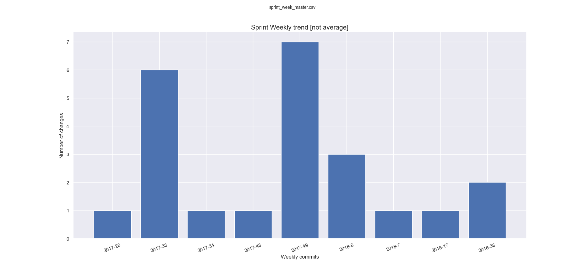
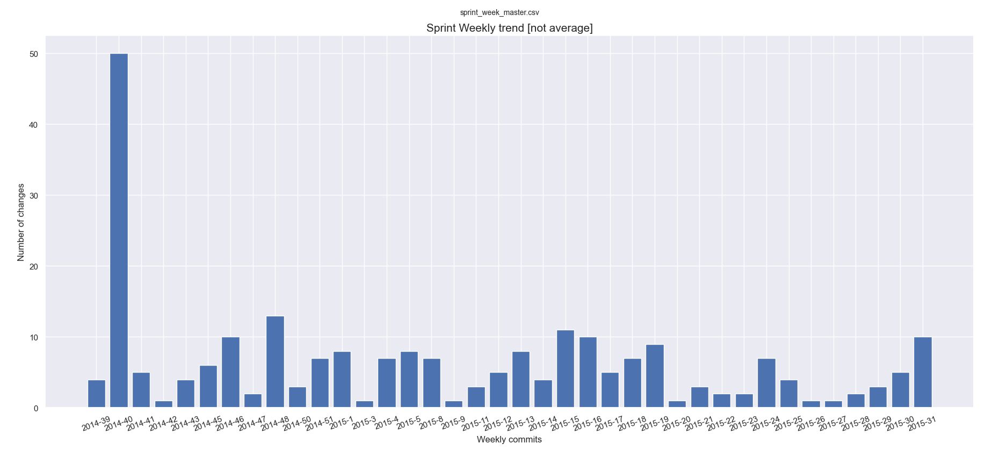
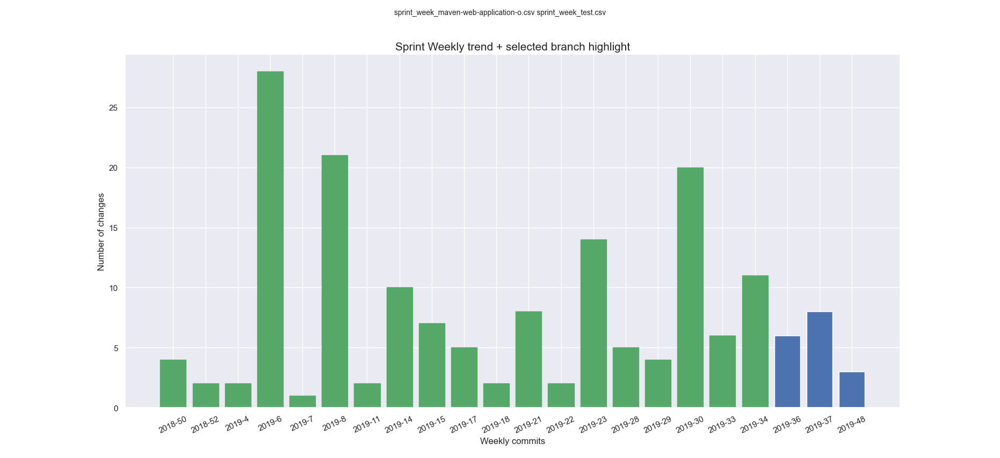
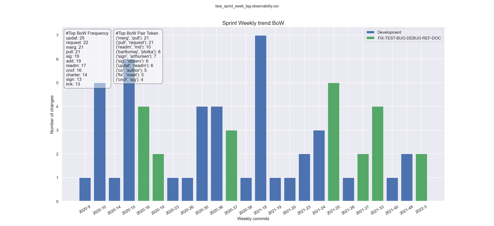

# M.S.R.
[](README.en.md)

Creazione ex novo del progetto di M.S.R. dei repository in Git. 

Riconversione ed ampliamento del progetto esistente da Java ☕ -> Python 3 🐍

## Details
Il progetto consiste nella creazione di una serie di metriche 
specifie e peculiari per analizzare, un repository o una lista
di questi (.git url e local repository), seguendo i dettami 
della M.S.R. al fine di ottenere possibili informazioni utili 
per l'Ingegneria del Software.


### 1. Activity per day of the week:
To calculate these values we collected and aggregated (in particular summarized) the commits for each day of the week. The goal is to have a graphical representation of the commit
distribution and to identify in which day or in which part of the week it is.

### 2. Activity per hour of the day:
Similar to the previous one, in this case, the commit data are distributed throughout the hours of the day. 
This metric shows in which part of the day, we usually have an activity peak and also provides a complete snapshot of the daily development activity.

### 3. Average commit distribution:
This indicator is calculated starting from each commit activity.
When we refer to commit activity, we mean all additions
and deletions every commit contains; the sum of these two
parameters is the "activity score" of the commit.
By excluding 10% of samples from both extremities, the mean is calculated on the 80%
of samples which is more accurate. Starting from this average value we consider all
the commits that have an activity score included between -25% and +25% of the previusly average value.

It's possible to specify: `None` to apply the metric to all kind of file or `.py .java .md etc`

### 4. Activity per week since the beginning of the current year:
In this case we retrieve the week trend commit data for the current year or the last year of the project.
Activity trend on the 52 weeks of a year. You can choose to analize the last year of the last commit made `False`
or the current nowaday year `True`.

### X. _MISSING_ ChangeWeek_trend
Manca la metrica che riporta lo storico del progetto rappresentato nell'arco delle 52 settimane di un anno.

### 5. Lines of code per week:
The lines of code metric shows the number of lines for every week. 
This indicator is very useful to study the evolution of the project as it highlights the
development phases and helps defining the adopted methodology, from the beginning to the end of project.

### 6. Sprint week commit trend (Scrum):
Metrica per individuare la possibile presenza di un 
approccio Agile: Scrum Sprint, che il team di sviluppo 
software ha adottato sul singolo repository.
Ciascuna delle Sprint sono costituite essenzialmente da 3 
settimane impiegate allo sviluppo +1 dedicata al Testing.
La ricerca viene effettuata sia sullo storico del repository in totale
che sui singoli remote branch che lo costituiscono.
La metrica si basa sulla ricerca e report di questa finestra temporale
con relative conclusioni. [Sprint_plot.py](Sprint_plot.py) ne grafica i risultati.

_I dati raccolti NON riportano la media, ma il count settimale dei commit._

**_Automatismo sugli esiti e Formula_**:
Per ricercare e stabilire la buona riuscita dei risultati ottenuti,
si è definito un automatismo sugli esiti che ne validi i risultati.
E' stata creata una finestra temporale (SLIDING WINDOW), la cui dimensione
viene stabilita a priori arbitrariamente, 
che va alla ricerca dei possibili Scrum presenti nello storico del progetto. 
L'obiettivo è quello di determinare e stabilire delle thresholds da applicare
per individuare lo Scrum che varia da progetto a progetto.

Una volta stabilita quale deve essere considerata come prima sprint lecita dalla quale
poi determinare le successive: `SCRUM_SEQUENCE`
e la dimensione della finestra **n**: `SLIDING_WINDOW`. La finestra viene cosi 
interpretata: le prime _n-1°_ settimane sono da intendere come Sprint di sviluppo, la 
rimanente Sprint _n°_ come settimana di testing.

Definita la finestra si applicano dei filtri ai dati raccolti al fine 
di soddisfare i seguenti asset:
+ gli Sprint contenuti nella finestra temporale devono essere settimane temporalmente _consecutive_
+ gli Scrum devono soddisfare la regola/soglia tale per cui, la media dei commit 
delle prime _n-1°_ settimane deve essere maggiore della successiva _n-iesima_:
`media(n-1)°>n°`
+ non fare _accavallare_ gli sprint tra loro

Gli esiti della ricerca automatica degli Sprint sono riportati da [Sprint_plot_Auto.py](Sprint_plot_Auto.py)

_I dati raccolti NON riportano la media, ma il count settimale dei commit._

[comment]: <> (_Nota: la metrica Sprint non conteggia e non riporta le settimane senza commit._)

### 7. Bag-of-Words Sprint week commit message:
Metrica per individuare la possibile presenza di un 
approccio Agile: Scrum Sprint.
La metrica si basa sulla ricerca della finestra temporale di ciascun Sprint
studiando il contenuto dei messaggi dei commit settimanali. Con l'ausilio 
della tecnica di BoW si determinano la presenza di parole chiavi quali: FIX-BUG-DEBUG-DOC-REF-TEST
per distinguere i commit effettuati durante la fase di Testing dalla fase di sviluppo del repository.
[Sprint_BoW_plot.py](Sprint_BoW_plot.py) ne grafica i risultati.

_I dati raccolti NON riportano la media, ma il count settimale dei commit._

### Requires
[comment]: <> (Pronto prova)
* Python 3.8
* Git
* [PyDriller](https://github.com/ishepard/pydriller): a  Python framework that helps developers in analyzing Git repositories
* [giturlparse](https://pypi.org/project/giturlparse/): Parse & rewrite git urls (supports GitHub, Bitbucket, FriendCode, Assembla, Gitlab …)
#### Requirements:
requirements.txt comprende la lista delle third party packages con i relativi version numbers
````commandline
pip freeze > requirements.txt
````
Per eseguire [Sprint_Bow_plot.py](Sprint_BoW_plot.py) si richiedono il download dei seguenti package:
* Per nltk **stopwords**:
````commandline
import nltk
nltk.download('stopwords')
````
* Per **spacy**:
````commandline
python -m spacy download en_core_web_sm
````

## Quick usage:
Git clone
````commandline
git clone https://github.com/Fliki1/MSR.git
````
Creare un nuovo ambiente venv nella directory desiderata
````commandline
python3 -m venv venv/
````
Installare le dipendeze del progetto dentro una virtual enviroment attiva
````commandline
source venv/bin/active
pip install -r requirements.txt
````
Start script
````commandline
python main.py [-h] [-w] [-hrs] [-avg AVERAGE] [-yr True/altro] [-l] [-s] [-b] [-v]
````
````commandline
  -h, --help     show this help message and exit
  -w, --week     metrica: week commit
  -hrs, --hour   metrica: hour commit
  -avg AVERAGE, --average <AVERAGE>   metrica: average commit distribution: None | .py | .md etc
  -yr YEAR, --year YEAR   metrica: last year week commit
  -l, --line     metrica: line trend commit
  -s, --sprint   metrica: sprint weeks commit
  -b, --sprintbow   metrica: sprint weeks commit BoW
  -v, --verbose  restituisce output verboso
````

#### Ambiente di sviluppo
Sto usando PyCharm per gestire un ambiente venv con Python 3.8.
* Al fine di prevenire problemi di dependency, rendere il progetto riproducibile e auto-contenuto.
* Per installare i dovuti packages su un host che non si hanno i permessi admin.
* Evita l'uso della directory `side-packages/` quando si necessità l'uso di questi solo per un progetto.

## Esiti 6. Sprint week
Plot della metrica Sprint week effettuato con [Sprint_plot.py](Sprint_plot.py) e [Sprint_plot_Auto.py](Sprint_plot_Auto.py) 
specificando il path dove sono presenti i CSV file, dentro la cartella [Final result](./final-results) o [Data results](./data-results).
Le due cartelle riportano gli esisti rispettivamente di tutto l'andamento del repository o dei singoli remote branch che lo caratterizzano.
Lo script esegue una serie di report grafici tutti vincolati allo studio dello Scrum:
* numero andamento commit negli sprint
* andamento sprint nel corso degli anni per intero (conteggio settimane senza sprint)
* numero autori degli sprint
* combinazione di sprint su branch diversi: feature vs test
* ricerca automatica degli Scrum Sprint evidenziandone le settimana di sviluppo da quelli di testing/debugging

Start script:
````commandline
python Sprint_plot.py
Enter CSV Repositories: data-results/sprint_week_nomerepository.csv
````

#### Esempio 1: master branch


#### Esempio 2: master banch


#### Esempio 3: [maven-web-application-o](https://github.com/yuvaraj3115/maven-web-application-o)
##### Sprint

##### Sprint + valori commit per settimana

##### Autori

##### Sprint + Autori

##### Sprint nell'intero storico attuale del progetto

##### Main branch + sotto branch (es: testing)


Start script:
````commandline
python Sprint_plot_Auto.py
Enter CSV Repositories: data-results/sprint_week_nomerepository.csv
````
##### Scrum Sprint Threshold


## Esiti 6.2 Branches Sprint week
Plot della metrica Branches sprint week effettuato con [Sprint_plot_branch.py](Sprint_plot_branch.py)
specificando il path dove sono presenti i CSV file, dentro la cartella [final-results](final-results).
Per il plot del Branches Sprint week è richiesta l'esecuzione della metrica 6. Sprint week.
Non vengono applicate modifiche ai file CSV ne generati di nuovi. I risultati sono
direttamente visibili a schermo. L'esecuzione dello sprint richiede il folder
del repository di studio e il csv del main/master branch.

Start script:
````commandline
python Sprint_plot_branches.py
Enter Repository branch folder: final-results/roposityname/sprint_week_nomemasteromain.csv
````

#### Branch bar graph
Il grafico raffigura l'ammontare di effort di tutti i branch nell'arco delle 
sprint week


#### Percentage branches bar
Si rappresentano gli sprint_week effort dei branches in percentuale.
Nel main/master gli sprint_week effort minori dell'1% vengono filtrati e sommati
in un unico campo chiamato Other in grigio. I rimanenti branches vengono
raffigurati solo le prime 4 settimane di sprint effettivo, indipendentemente
dalle tempistiche.


#### Percentage branches only
Si rappresentano solo le percentuali di sprint week effort dei branches
escluso il main/master. Vengono raffigurati solo le prime 4 settimane di sprint effettivo, indipendentemente
dalle tempistiche.


#### Percentage main only
Si rappresentano solo le percentuali di sprint week effort del main/master.
Gli sprint_week effort minori dell'1% vengono filtrati e sommati
in un unico campo chiamato Other in grigio.


## Esiti 7. Bow Sprint week
Plot della metrica BoW Sprint week effettuato con [Sprint_BoW_plot.py](Sprint_BoW_plot.py) specificando il path dove sono presenti i CSV file, dentro la cartella [data-results](./data-results).
Per il plot del BoW Sprint week è richiesta anche l'esecuzione della metrica 6. Sprint week.
La cartella data-results conterrà in questo modo gli esisti di entrambe le metriche.

Lo script esegue tutto il processo di BoW consistente nella rimozione 
delle **stopwords** dal testo dei messaggi, nella conversione a un dominio comune delle parole dei messaggi
con l'operazione di **stemming** e in fine una ricerca per **matching** delle parole a noi interessate:
FIX-BUG-DEBUG-TEST-REF-DOC.
In base all'occorrenza di questi nei messaggi dei commit dell'arco della settimana associano un tag alla Sprint
di appartenenza.

Start script:
````commandline
python Sprint_BoW_plot.py
Enter CSV Repositories: data-results/sprint_week_nomerepository.csv
````
#### BoW plot
Ne vengono riportati anche le parole e coppia di parole più usate nei commenti.


#### TODO:

1. Vedere se funziona:
````commandline
python3 -m venv venv
source venv/bin/activate
````
E poi installare i requirements:
````commandline
pip install -r requirements.txt
````
2. Ricreare la metrica mancante? (X.)
